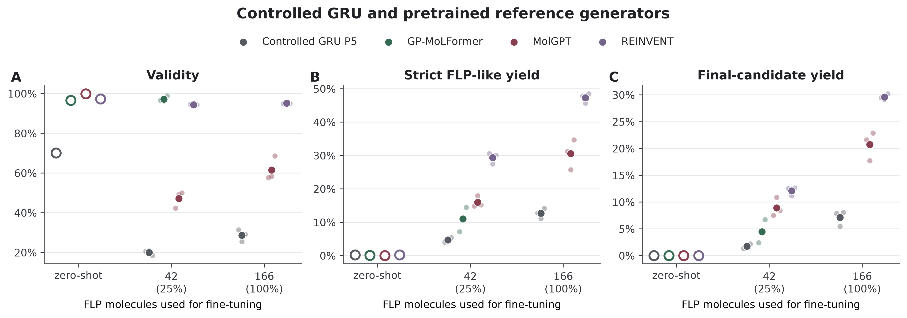

# Low-data generation of boron-centered FLP-like molecules

This repository studies how the chemical composition of a pretraining corpus affects molecular generation in a small and atypical target domain: boron-centered frustrated Lewis pair (FLP)-like structures.

The operational target requires a neutral tricoordinate boron Lewis-acid centre and an allowed phosphorus- or nitrogen-based Lewis-base centre. Al-, Si- and Ge-only Lewis-acid systems are outside the primary scope; they are not classified as chemically invalid.

The central controlled experiment keeps the tokenizer, GRU architecture, corpus size, training budget and FLP fine-tuning data fixed. Only the fraction of main-group molecules in pretraining changes: `P0` (0%), `P0.1` (0.1%), `P1` (1%) and `P5` (5%). MolGPT, REINVENT and GP-MoLFormer are included as external reference models, not as a causal architecture comparison.

P0.1 is part of the frozen-prior analysis only. The generation-level dose experiment compares P0, P1 and P5.



## Main results

- The frozen-prior FLP BPC gap decreases from `1.134` for P0 to `0.530` for P5.
- The four-level frozen-prior trend is monotonic in all three seeds (exact blocked permutation `p = 7.2e-5`).
- P0 and P5 remain closely matched in the full corpora: the largest absolute structural SMD is `0.010`, and SMILES-token Jensen-Shannon divergence is `0.00066`.
- The 7,500 selected main-group molecules in P5 contain B in `40.1%`, P in `40.4%`, N in `49.9%`, Si in `11.3%`, Al in `5.0%` and Ge in `5.0%`; `12.5%` contain B together with P or N.
- Of the 299 curated reference structures, 285 (`95.3%`) contain B. The remaining 14 are Al-containing systems, including two that also contain Si.
- With 166 FLP molecules, strict FLP-like yield rises from `8.36 +/- 0.95%` for P0 to `12.64 +/- 1.29%` for P5 across six paired seeds.
- The initial and additional seed cohorts both favour P5 in 3/3 seeds. Their mean strict-yield changes are `+4.04` and `+4.53` percentage points, respectively. The pooled estimate is `+4.29` points (95% CI `+2.61` to `+5.97`).
- With the checkpoint fixed in advance at 8,000 exposures, strict yield is `8.22%` for P0 and `12.36%` for P5. The paired effect is `+4.13` points (95% CI `+2.29` to `+5.97`), with P5 ahead in all six seeds.
- The exact one-sided sign test is `p = 0.125` within each three-seed cohort. Because the pooled direction was not preregistered, the six-of-six pooled result is reported with a two-sided sign-test value of `p = 0.0313` and treated as supporting seed replication rather than an independent confirmation.
- For P5, `12.64%` strict FLP-like yield becomes `10.93%` after reference-set novelty filtering and `7.07%` after the similarity window and remaining final-candidate filters.
- At 166 molecules, final-candidate yield is `7.1%` for controlled GRU P5, `20.7%` for MolGPT and `29.6%` for REINVENT. The archived GP-MoLFormer benchmark contains only the 42-molecule experiment, where its yield is `4.5%`. An earlier draft quoted `14.5%` from an unarchived exploratory 166-molecule run; that value is not included in the frozen comparison.
- A data-matched character 5-gram baseline produces no final candidates. The rule-based fragment recombination library gives `50.3%` candidates outside the curated seed set, but template-relative final novelty is zero because the library itself is used as the template reference.
- P5 final candidates are mostly outside the immediate neighbourhood of that library: their median nearest-library ECFP4 Tanimoto similarity is `0.426`, only `1.5%` reach `0.8`, and `15.5%` share a Murcko scaffold with a library member. P0 gives a similar distribution. P5 therefore increases candidate yield without materially shifting proximity to the enumerated fragment space.
- A first blinded review accepted 68 of 72 sampled final candidates (94.4%, Wilson 95% CI 86.6-97.8%). In a second mixed review, all 24 model candidates were accepted and 13 of 21 filter-derived decoys were rejected. Three accepted decoys were Al/Si-only systems outside the B-centered study scope. Their acceptance was chemically reasonable and consistent with assessment based on broader FLP chemistry rather than mechanical reproduction of the endpoint. Within the B-centered scope, 13 of 18 decoys were rejected.

The frozen-prior BPC gap and the post-fine-tuning validation BPC difference measure different stages. Fine-tuning reduces P0 minus P5 validation BPC to `0.0187` bits, while the generation yields remain separated. In this experiment, similar teacher-forced validation likelihood after adaptation does not imply identical sampling behaviour.

Moving from validation-selected to fixed checkpoints changed strict yield by only `0.14` percentage points for P0 and `0.28` points for P5, whereas the P5-P0 prior effect remained `4.13-4.29` points. The effect also persisted after downstream filters: at the fixed checkpoint, final-candidate yield was `4.28%` for P0 and `6.73%` for P5 (`+2.46` points; 95% CI `+1.01` to `+3.90`; 6/6 paired wins).

These results support a limited claim: a chemically closer prior improves low-data adaptation in the controlled GRU experiment. `Strict FLP-like` is a B-centered structural screening rule. It does not establish frustration, catalytic activity or synthetic accessibility.

## Repository structure

```text
data/          Curated FLP split and controlled pretraining corpus
notebooks/     GPU experiments in execution order
evaluation/    Frozen FLP evaluator v2.1.1
scripts/       Recalculation, baselines and publication figures
results/       Aggregated results and compact raw controlled runs
figures/       Publication figures in PNG/PDF/SVG
tests/         Evaluator and dataset checks
configs/       Frozen experiment metadata
artifacts/     Instructions for large weights and external raw runs
```

## Quick start

Create the analysis environment:

```bash
conda env create -f environment.yml
conda activate flp-low-data-generation
```

Run all checks:

```bash
python -m unittest discover -s tests -v
```

Rebuild the final figures and tables:

```bash
python scripts/rebuild_release.py
```

The command rebuilds all analysis tables and figures, then runs the test suite. It reads the compact tables in `results/` and writes publication outputs to `results/publication_tables/` and `figures/`.

## Recalculate the controlled experiment

The raw generation archives needed for this step are included because they are small:

```bash
python scripts/evaluate_controlled_priors_v2.py \
  --archive results/raw_controlled/pretraining/controlled_prior_pretraining_results.zip \
  --out-dir results/recomputed/controlled_priors

python scripts/evaluate_controlled_prior_learning_curves_v2.py \
  --archive results/raw_controlled/learning_curves/controlled_prior_learning_curves_results.zip \
  --out-dir results/recomputed/controlled_prior_learning_curves

python scripts/evaluate_controlled_prior_confirmatory_v2.py \
  --archive results/raw_controlled/confirmatory/controlled_prior_confirmatory_results.zip \
  --out-dir results/recomputed/controlled_prior_confirmatory \
  --learning-dir results/recomputed/controlled_prior_learning_curves
```

## Repeat GPU training

Run the notebooks in order:

1. `01_controlled_prior_pretraining.ipynb`
2. `02_controlled_prior_learning_curves.ipynb`
3. `03_controlled_prior_confirmatory.ipynb`
4. `04_fixed_checkpoint_sensitivity.ipynb`

Upload `data/controlled_priors/controlled_prior_corpora.zip` to Colab or Kaggle before the first run. Each notebook saves its result and weight archives for the next stage. Notebook 4 uses the prior checkpoints from `controlled_prior_pretraining_weights.zip` and `controlled_prior_confirmatory_weights.zip`; it does not repeat prior pretraining. The three external-model notebooks reproduce the reference-model track.

PyTorch should be installed for the CUDA version available on the machine. Colab and Kaggle already provide it; avoid replacing their PyTorch build unless necessary.

## Reproducibility notes

- Initial training seeds: `11, 22, 33`; additional seeds: `44, 55, 66`.
- Generation seeds: `101, 202, 303`.
- Generation seeds are averaged within each training run. The training seed is the unit of replication.
- The evaluator was frozen at version `2.1.1` before the final recalculation.
- The manual validation sample was drawn after the automatic filter was frozen.
- The blinded decoy panel and its scored results are in `results/blind_decoy_review/`.
- Model weights and large external archives are documented in [artifacts/README.md](artifacts/README.md) and are not stored in Git.

Further details are in [REPRODUCIBILITY.md](REPRODUCIBILITY.md), [data/README.md](data/README.md) and [evaluation/README.md](evaluation/README.md).
